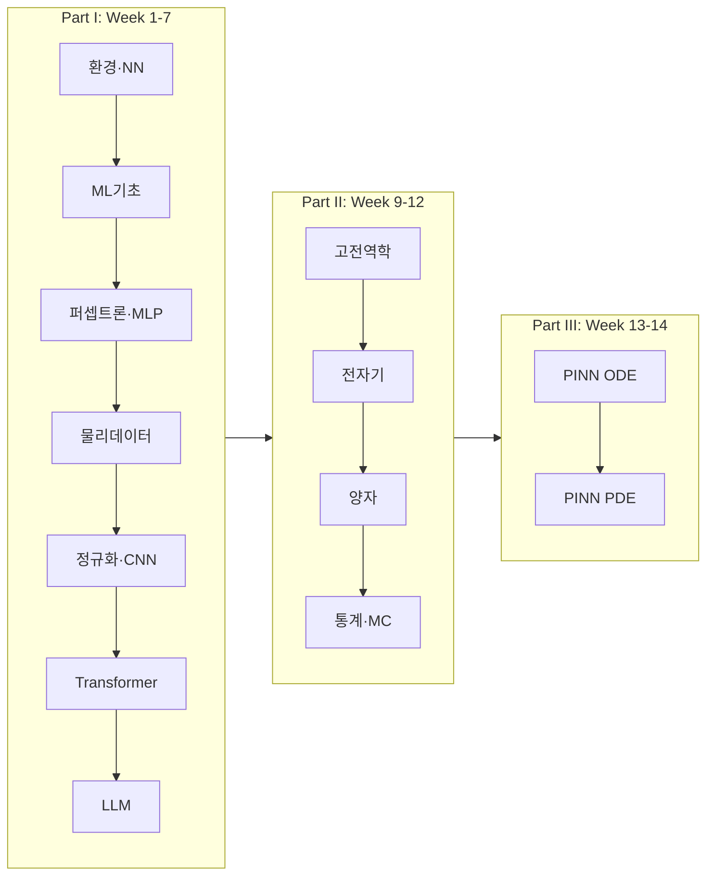

# 전산물리: AI와 물리학의 만남

**Computational Physics: From Neural Networks to Physics-Informed AI**

| 항목 | 내용 |
|------|------|
| 개설 | 부산대학교 물리학과 |
| 대상 | 2학년 / 2026년 1학기 |
| 시간 | 주 3시간 (강의 2 + 실습 1) |
| 도구 | Python 3.12+, [uv](https://docs.astral.sh/uv/), Cursor, TensorFlow, SciPy, Matplotlib |
| 저장소 | [github.com/BogKim2/AIandMLcourse](https://github.com/BogKim2/AIandMLcourse) |

**요약본(짧은 안내):** [`README_simple.md`](README_simple.md) — 아래는 **확장판**입니다.

이 **`README.md`** 는 저장소 **폴더·파일을 한 곳에 상세히 기술한 인덱스**입니다. **강의 16주 전체의 이론·교재·평가비율**은 [`course.md`](course.md)가 정본이고, **주차 내부 이론·수식·단계별 설명**은 각 폴더의 **`weekN.md`** 를 읽는 것이 가장 정확합니다. **체크리스트·난이도·추가 참고**는 [`directory.md`](directory.md)에 보조적으로 정리되어 있습니다.

---

## 이 문서의 쓰임새

| 읽는 사람 | 권장 읽는 순서 |
|-----------|----------------|
| **처음 clone 한 학생** | [빠른 시작](#빠른-시작) → [환경·의존성(상세)](#환경의존성-상세) → 해당 주 [주차 상세](#주차별-상세-가이드) |
| **특정 주차만 복습** | [주차·파일 색인표](#주차파일-색인표) → 해당 `weekN/` 절 |
| **과제/출제 담당** | 루트 `AI&MLhw.xlsx`, [`course.md`](course.md) 평가 항 |
| **LaTeX·행정** | [`plan/`](#plan-강의계획서-latex) 절 |
| **문서화·PDCA** | [`docs/`](#docs-내부-문서-및-메타데이터) 절 |

---

## 목차

1. [빠른 시작](#빠른-시작)
2. [환경·의존성(상세)](#환경의존성-상세)
3. [커리큘럼 흐름](#커리큘럼-흐름)
4. [저장소 최상위 구조](#저장소-최상위-구조)
5. [주차별 상세 가이드](#주차별-상세-가이드) (Week 1–7, 9–14)
6. [Week 8 (폴더 없음)](#week-8-중간고사--vibe-coding-저장소에-week8-없음)
7. [`plan/` 강의계획서 (LaTeX)](#plan-강의계획서-latex)
8. [`docs/` 내부 문서 및 메타데이터](#docs-내부-문서-및-메타데이터)
9. [`.cursorrules` 요약](#cursorrules-요약)
10. [실행·디버깅·FAQ](#실행디버깅faq)
11. [주차·파일 색인표](#주차파일-색인표)
12. [참고 문헌](#참고-문헌)

---

## 빠른 시작

```powershell
cd aicoursework

uv venv
uv sync

cd week1
uv run python 00_hello_world.py
uv run python 01_hello_nn.py
```

- Python **`>= 3.12`** (`.python-version` 에 `3.12` )
- 루트에서 `uv run python main.py` 를 실행하면 샘플 메시지가 출력됩니다.

---

## 환경·의존성(상세)

### `pyproject.toml` 에 명시된 패키지

| 패키지 | 용도 |
|--------|------|
| `tensorflow>=2.15` | Week 1–5, 4, 7 일부, Week 13–14 PINN |
| `numpy` | 전 주차 공통 |
| `matplotlib` | 시각화 |
| `scipy` | Week 2–4, 9–11, PINN의 RK4·ODE 등 |
| `seaborn` | 보조 플롯 |
| `reportlab` | PDF 생성(예: Week 1 `guides` 등) |

`uv.lock` 이 있으므로 **재현 가능한 설치**는 `uv sync` 를 권장합니다.

### 별도 설치가 필요할 수 있는 항목

| 상황 | 조치 |
|------|------|
| `week13/06_comparison_frameworks.py` 실행 시 `psutil` 오류 | `uv pip install psutil` (현재 `pyproject.toml` 에 미포함일 수 있음) |
| PINN/딥러닝 **GPU** | NVIDIA 환경에 맞춰 TensorFlow GPU 빌드 또는 [TensorFlow GPU 가이드](https://www.tensorflow.org/install) 참고 |
| `torch` | 이 저장소의 **주요 실습은 TensorFlow 중심**입니다. `torch` 는 `pyproject.toml` 에 없으며, 스크립트가 `import torch` 를 요구할 때만 [PyTorch](https://pytorch.org/) 안내에 따라 설치 |

### 가상환경

- **`.venv/`** 는 로컬에 생성되며, 기본적으로 **`.gitignore`** 로 Git 에 올라가지 않습니다.
- **`.claude/`** (Claude Code 로컬 설정)도 제외될 수 있습니다. clone 직후에는 이 폴더가 없을 수 있습니다.

---

## 커리큘럼 흐름



- **Week 8** 은 **중간고사·Vibe coding** — 저장소에 `week8/` **폴더가 없고**, 일정·내용은 [`course.md`](course.md) 만 참고합니다.
- **Week 15–16** (최종 프로젝트·기말) 역시 **코드 폴더는 저장소에 없을 수** 있으며 `course.md` 가 정본입니다.

---

## 저장소 최상위 구조

| 경로 | 설명 |
|------|------|
| `pyproject.toml`, `uv.lock` | 패키지 선언 및 lock |
| `.python-version` | 3.12 |
| `.gitignore` | `__pycache__`, `.venv`, `.claude/` 등 |
| `course.md` | **강의 전체** 개요·16주·평가·교재 (긴 문서) |
| `directory.md` | 주차별 구조, 난이도, 체크리스트, 실행 예 (보조) |
| `README.md` | **본 문서 (저장소 인덱스)** |
| `main.py` | `Hello from aicoursework!` 샘플 |
| `AI&MLhw.xlsx` | 과제/출제용 스프레드시트 (강의 운용) |
| `.cursorrules` | Cursor / AI 에이전트용 코딩 규칙 (한글 폰트, 산점도 규칙 등) |
| `week1` … `week14` | 주차 실습 (아래 **주차별 상세** 참고) |
| `plan/` | LaTeX 강의계획서 + PDF |
| `docs/` | 분석 MD, PDCA / bkit 메타 JSON (로컬·도구에 따라 갱신) |
| `.bkit/` (있을 수 있음) | bkit 에이전트 상태 (로컬) |

---

## 주차별 상세 가이드

아래에서 **「학습 요지」** 는 [`course.md`](course.md) 와 주차 문서를 요약한 것이고, **파일 표** 는 **현재 저장소에 존재하는 경로**를 기준으로 합니다.

---

### Week 1 — `week1/`: 강의 소개 및 환경 설정

**학습 요지:** Git, Cursor, `uv` 로 개발 환경을 갖추고, TensorFlow 로 가장 단순한 NN 을 돌려 보며 `polyfit` / `curve_fit` 등 **전통 수치해법과 비교**합니다.

| 파일 | 역할 |
|------|------|
| `00_hello_world.py` | Python·TensorFlow·Matplotlib 가동 확인 |
| `01_hello_nn.py` | 선형 관계(예: `y = 2x - 1`)를 SGD 로 학습 |
| `02_polynomial_fitting.py` | 다항식 핏으로 과적합/표현력 직관 |
| `week1.md` | 학생용 **상세** 가이드(설치, 실행 순서, 이론) |
| `hw1.md` | 과제 1 관련 안내 |
| `guides/generate_pdfs.py` | PDF 자료 생성용 스크립트 |
| `guides/01_*.pdf` ~ `05_*.pdf` | Antigravity·Cursor·uv·개발환경·AI in Physics 안내 PDF |
| `outputs/*.png` | 학습 곡선, 모델 핏, 수치 비교 그림 |

**권장 실행 순서:** `00` → `01` → `02` → (필요 시) `guides` 내용 읽기.

---

### Week 2 — `week2/`: 머신러닝 기초

**학습 요지:** 지도(선형회귀)·비지도(K-Means)·전처리·손실·경사하강의 시각화. 물리 맥락으로 **훅의 법칙** 데이터를 사용합니다.

| 파일 | 역할 |
|------|------|
| `01_linear_regression_spring.py` | 스프링 데이터 선형 회귀 (TensorFlow) |
| `02_unsupervised_clustering.py` | K-Means 등 군집 |
| `03_data_preprocessing.py` | 정규화·스케일링 개념 |
| `04_gradient_descent_vis.py` | GD 궤적 시각화 |
| `ex/01_spring_scipy.py` | SciPy 기반 스프링 피팅 (보조) |
| `ex/04_optimization_scipy.py` | SciPy 최적화 예제 (보조) |
| `week2.md` | 이론·실습 상세 |
| `outputs/*.png` | `spring_fitting`, 클러스터링, 전처리, GD, `ex_*.png` |

---

### Week 3 — `week3/`: 신경망 기초

**학습 요지:** 퍼셉트론·활성화·순전파·NumPy MLP·XOR·근사정리 시각화.

| 파일 | 역할 |
|------|------|
| `01_perceptron.py` | AND/OR/XOR 한계, 단층 퍼셉트론 |
| `02_activation_functions.py` | ReLU, Sigmoid, Tanh 비교 |
| `03_forward_propagation.py` | 순전파 구조 |
| `04_mlp_numpy.py` | 순수 NumPy MLP, XOR |
| `05_universal_approximation.py` | UAT 데모 |
| `check_fonts.py` | Matplotlib 한글 폰트 확인 |
| `week3.md` | 상세 이론 |
| `outputs/01_*.png` ~ `05_*.png` | 각 실습 대응 그림 |

---

### Week 4 — `week4/`: 물리 데이터로 학습

**학습 요지:** Keras/TensorFlow 로 1D 함수·포물선·과적합·진자(RK4 데이터) 학습.

| 파일 | 역할 |
|------|------|
| `01perfect1d.py` | `sin`, 다항·복합 1D 함수 근사 |
| `02projectile.py` | 포물선 궤적 입력→출력 회귀 |
| `03overfitting.py` | 과적합/과소적합, Dropout 등 |
| `04pendulum.py` | 비선형 진자 주기·RK4 연계 |
| `week4.md` | Lab 순서, 요구사항 |
| `outputs/` | 1D 근사, 네트워크 크기 비교, 극한 함수 테스트 등 |

---

### Week 5 — `week5/`: 딥러닝 핵심 기법

**학습 요지:** L1/L2, Dropout, BatchNorm, Augmentation, Transfer learning, **MNIST CNN**.

| 파일 | 역할 |
|------|------|
| `01_regularization.py` | 정규화 기법 비교 |
| `02_overfitting_underfitting.py` | 모델 용량 vs 데이터 |
| `03_data_augmentation.py` | 이미지식 증강 개념 |
| `04_transfer_learning.py` | MobileNetV2 등 사전학습 특성 추출 |
| `05_mnist_cnn.py` | MNIST CNN 분류 |
| `week5.md` | 상세 |
| `outputs/` | 정규화 곡선, MNIST 결과 PNG, `04_transfer_learning_summary.txt` |

---

### Week 6 — `week6/`: Transformer·Attention

**학습 요지:** Scaled dot-product, Self-Attention, Multi-Head, Positional encoding, 트랜스포머 블록, 시퀀스 모델링(교재: *Attention Is All You Need* 참고).

| 파일 | 역할 |
|------|------|
| `01_attention_basics.py` | Q, K, V, 스케일링 |
| `02_self_attention.py` | Self-Attn, Multi-Head |
| `03_positional_encoding.py` | 사인/코사인 PE |
| `04_transformer_block.py` | 인코더 블록(잔차·LayerNorm) |
| `05_sequence_modeling.py` | 시퀀스 태스크 데모 |
| `run.bat` | Windows 에서 01–05 순차 실행 |
| `week6.md` | 이론·수식·실행 안내 |
| `outputs/*.png` | 다수(어텐션 맵, PE, RNN vs Attn, 성능 비교 등) |

---

### Week 7 — `week7/`: LLM 개론

**학습 요지:** 토큰·BPE·임베딩, GPT vs BERT, pretrain/fine-tune/RLHF, API·프롬프트(시뮬).

| 파일 | 역할 |
|------|------|
| `01_tokens_and_embeddings.py` | 토큰화·임베딩·컨텍스트 창 |
| `02_gpt_bert_architectures.py` | 양방향 vs 단방향 마스킹 |
| `03_pretraining_finetuning.py` | 학습 파이프라인 개념 |
| `04_claude_api_simple.py` | API 파라미터·물리응용 아이디어(교육용 시뮬) |
| `run.bat` | 순차 실행 |
| `week7.md` | 상세 |
| `outputs/*.png` | 토크나이징, 아키텍처, 파이프라인, API 응용 |

**안내:** Part I 끝 **중간 프로젝트(요약 발표)** 가 [`course.md`](course.md) 기준에 있습니다.

---

## Part II: Week 9–12 (전산 물리·시뮬레이션)

### Week 9 — `week9/`: 고전 역학

**학습 요지:** Euler vs RK4, 케플러·행성, 이중 진자(혼돈), 라그랑지/해밀토니 정식화 비교. **LLM 을 써서 코드 생성·최적화**하는 심화가 과제에 포함될 수 있습니다([`course.md`](course.md) 과제 3).

| 파일 | 역할 |
|------|------|
| `01euler_rk4.py` | 같은 ODE 에 대해 정확도·오차 비교 |
| `02planetary.py` | 다체/행성 궤도, `T² ∝ a³` 검증 요소 |
| `03chaotic_pendulum.py` | 이중 진자, 상공간, 혼돈 지표 |
| `04lagrangian_hamiltonian.py` | L, H 정식화 비교 |
| `ex/01three_body.py` | 제한된 3체·궤적(8자, 태양-지구-달 등) |
| `ex/02llm_optimization.py` | LLM 기반 파라미터/코드 탐색 예시 |
| `ex/outputs/*.png` | `ex` 전용 궤적·보존량 그림, `README.md` |
| `week9.md` | 상세 |
| `outputs/*.png` | 수치해법, 태양계, 케플러, 혼돈, L/H/상공간 |

---

### Week 10 — `week10/`: 전자기학

**학습 요지:** 쿨롱/전위/전기력선, 비오-사바르, 로렌츠, 1D/2D FDTD·CFL, 전자기파(애니메이션), 라플라스(도체·원통).

| 파일 | 역할 |
|------|------|
| `01_electric_field_basics.py` | 점전하 전기장 |
| `02_electric_potential.py` | 전위 등고선 |
| `03_electric_field_lines.py` | 전기력선 |
| `04_magnetic_field_basics.py` | 전류·비오-사바르 |
| `05_lorentz_force.py` | `F = q(E + v×B)` 궤적 |
| `06_maxwell_1d.py` | 1D 파동(시간-공간) |
| `07_maxwell_2d.py` | 2D |
| `08_multiple_charges.py` | 복수 전하 상호작용 |
| `09_em_wave_animation.py` | `09_em_wave.gif` 등 **GIF** 생성 |
| `10_conductor_potential.py` | 도체/원통 캐패시터 전위 |
| `run.bat` | 통합 실행(Windows) |
| `week10.md` | 상세 |
| `outputs/*.png` + `09_em_wave.gif` | 정전기·자기·파동 시각자료 |

---

### Week 11 — `week11/`: 양자역학(수치)

**학습 요지:** 1D 잠재에서의 유한차분/행렬대각화, 터널링, 우물·조화진동자, (보조) **수소** 행렬·구면조화.

| 파일 (메인) | 역할 |
|------|------|
| `01schrodinger.py` | 1D 시간비의존/비의존 기초 |
| `02wavefunction.py` | 파동함수·패킷·중첩 |
| `03tunneling.py` | 사각 장벽·공명 |
| `04wells_oscillator.py` | 유한/무한 우물, SHO |
| `coursematerial/01visualizehamiltonian.py` | 해밀토니안 행렬·고유 모드(교재용) |
| `coursematerial/02hydrogenatom.py` | 수소(각운동량 보조) |
| `coursematerial/03hydrogenatom_spherical.py` | 구면좌표 수소 |
| `coursematerial/*.png`, `*.txt` | 수소/행렬 **보조** 이미지·로그 |
| `week11.md` | 매우 상세(행렬 구성, 터널, 중첩) |
| `outputs/*.png` | 메인 실습 Plots(우물, 터널, 수소 궤적 등) |

---

### Week 12 — `week12/`: 통계물리·Monte Carlo

**학습 요지:** Random walk, π, 1D/2D Ising, Metropolis, 상전이, 열역학량.

| 파일 | 역할 |
|------|------|
| `01_random_walk.py` | 확산·`<R²>` ∝ t |
| `02_pi_estimation.py` | Monte Carlo π |
| `03_ising_1d.py` | 1D Ising(해 직접 비교) |
| `04_metropolis.py` | 메트로폴리스 |
| `05_ising_2d_basic.py` | 2D 격자 기본 |
| `06_phase_transition.py` | `T_c` 부근 |
| `07_thermodynamics.py` | 에너지·자화·비열 |
| `08_ising_2d_advanced.py` | 히스테리시스·상관(고급) |
| `week12.md` | 상세 |

**참고:** 저장소에 **`outputs/`가 비어 있거나 없을 수 있으며**, 실행 시 그래프·로그가 생성됩니다(시뮬 시간·스윕 횟수는 스크립트/환경에 따라 다름).

---

## Part III: Week 13–14 — Physics-Informed Neural Networks

### Week 13 — `week13/`: PINN — ODE

**학습 요지:** `GradientTape` 로 잔차·초기/경계 손실, 콜로케이션, RK4 대비, 로렌츠·VdP.

| 파일 | 수식/문제(요지) | 비고 |
|------|----------------|------|
| `01_simple_ode.py` | `y' = -y`, `y(0)=1` | PINN 입문 |
| `02_harmonic_oscillator.py` | `y''+ω²y=0` | 2계, 에너지 점검 |
| `03_damped_oscillator.py` | 감쇠(과/과소/치) | 3가지 regime |
| `04_boundary_value_problem.py` | 2계 BVP | FDM 과 비교 |
| `05_lorenz_system.py` | (σ,ρ,β) 혼돈, 3D attractor | |
| `06_comparison_frameworks.py` | VdP: PINN vs `odeint` | `psutil` 사용 가능 **→** 없으면 `uv pip install psutil` |
| `README.md` | 주차 **내부** 실행 설명 | 루트 `README` 와 별도 |
| `run_all.bat`, `run_all_auto.bat` | Windows 일괄 실행 | |
| `week13.md` | 이론·가중치·adaptive collocation | 매우 깁니다 |
| `outputs/*.png` | 잔차, 해비교, 로렌츠, 표 등 | |

**프레임워크:** docstring 기준 **TensorFlow** (`tf`) + SciPy `odeint` 비교. **PyTorch** 는 이 저장소 `pyproject.toml` 에 필수로 박혀 있지 않습니다(스크립트가 직접 import 하지 않는 한).

---

### Week 14 — `week14/`: PINN — PDE

**학습 요지:** 1D/2D 열·파동, Burgers, 복잡 경계(Dirichlet/Neumann 혼합).

| 파일 | 방정식(요지) |
|------|----------------|
| `01_basic_pinn.py` | PDE/PINN 구조 복습 |
| `02_heat_equation_1d.py` | `u_t = α u_xx` |
| `03_wave_equation_1d.py` | `u_tt = c² u_xx` |
| `04_heat_equation_2d.py` | 2D 열 |
| `05_burgers_equation.py` | `u_t + u u_x = ν u_xx` |
| `06_wave_equation_2d.py` | 2D 파동 |
| `07_complex_boundary.py` | L자/혼합 BC |
| `run_all.py` | Python 으로 전체 스크립트 호출 |
| `run_all.ps1` | PowerShell 래퍼 |
| `RUN_ALL.md` | 옵션·주의 |
| `week14.md` | 상세 이론 |
| `outputs/*.png` | 각 PDE 별 해보고 |

---

## Week 8 (중간고사· Vibe coding) — 저장소에 `week8/` 없음

[`course.md`](course.md) 에 따르면 **중간고사 / LLM 기반 코딩 입문**, Prompt, 디버깅에 초점이 있습니다. **실습용 폴더는 없으며**, Week 9 이전에 LLM 을 써서 `week9` 심화(`ex/02llm_optimization.py` 등)를 이해하는 **프롬프트**를 짜는 연습을 권장합니다.

---

## `plan/` 강의계획서 (LaTeX)

| 항목 | 설명 |
|------|------|
| `plan.tex` | 국문(또는 기본) 강의계획 **소스** |
| `plan.pdf` | 컴파일된 PDF (제출/배부용) |
| `plan_eng.tex` / `plan_eng.pdf` | 영문版 |
| `*.aux`, `*.log`, `*.out`, `*.fls`, `*.fdb_latexmk`, `*.synctex.gz` | **부산물** — 소스와 함께 두어도 되나, git 에서는 제외하거나 정리해도 됨(재생성) |

**편집 권장:** `*.tex` 만 수정 → 로컬 TeX( `latexmk -pdf` 등 )로 PDF 갱신.

---

## `docs/` 내부 문서 및 메타데이터

| 경로 | 설명 |
|------|------|
| `03-analysis/aicoursework-docs.analysis.md` | 문서/프로젝트 **분석 메모** (사람이 읽는 텍스트) |
| `.bkit-memory.json` | bkit 관련 **로컬 메타** (도구 실행으로 갱신) |
| `.pdca-status.json` | PDCA 한 사이클의 상태 |
| `.pdca-snapshots/snapshot-*.json` | 타임스탬프별 **스냅샷** (반복) |

> 공개/제출용 리포를 깔끔히 하고 싶다면, 위 **점(.)으로 시작하는 JSON** 과 `bkit` 메타는 `.gitignore` 로 빼는 방안이 있습니다(팀 합의 필요).

---

## `.cursorrules` 요약

- **한글** Matplotlib 폰트: Windows `Malgun Gothic`, Mac `AppleGothic` 등.
- **Scatter:** 속이 빈 마커(`x`, `+`) 는 `edgecolors` 사용 금지(경고·시각 품질). 채운 마커는 `edgecolors` 사용 가능.
- **가중치 초기화:** Xavier(시그모이드/탄젠트), He(ReLU) 규칙 명시.
- Week 1–3 위주로 스타일이 잡혀 있으며, 다른 주차도 동일 취지로 유지하는 것이 좋습니다.

---

## 실행·디버깅·FAQ

| 질문 | 답 |
|------|-----|
| 한 주를 한 번에? | `week6`, `7`, `10` → `run.bat` / `week13` → `run_all*.bat` / `week14` → `uv run python run_all.py` |
| ImportError: psutil | `uv pip install psutil` (Week 13 `06`) |
| `ModuleNotFoundError: torch` | 해당 스크립트를 열어 `import torch` 가 있는지 확인. 없다면 TensorFlow만으로 동작이어야 함. 있으면 PyTorch 를 별도 설치. |
| GPU 안 잡힘 | TensorFlow-GPU, CUDA, 드라이버 버전을 [공식 문서](https://www.tensorflow.org/install)에 맞출 것 |
| 그림 한글 깨짐 | `week3/check_fonts.py`, `.cursorrules` |
| Week 4 `outputs` 가 적다 | 로컬에서 스크립트를 다시 돌리면 전체가 재생성될 수 있음(저장소는 일부만 커밋) |

**평가(과제 비율, 기말·중간, 프로젝트)** 는 반드시 [`course.md`](course.md) 의 표를 따릅니다(아래는 **요약**이며, 변경 시 `course.md`·공지가 우선).

---

## 강의 운영(평가·과제·프로젝트) — `course.md` 요약

### 평가 비율

| 항목 | 비율 | 세부 |
|------|------|------|
| 과제 | 30% | 주간 과제 6회(각 5% 등) |
| 중간 프로젝트 | 15% | Part I 요약 발표 |
| 최종 프로젝트 | 25% | 팀(코드·보고서·발표) |
| 중간고사 | 10% | 이론·기본 실습 |
| 기말고사 | 15% | 종합 |
| 출석·참여 | 5% | 토론·참여 |

### 과제·프로젝트 일반 규칙(원문은 `course.md`)

- **제출:** GitHub 저장소, `.py` 위주, **README에 실행법·결과 해석** 기재(과제 안내에 따름).
- **최종 프로젝트:** 팀 규모·페이지·발표 시간 등은 `course.md`의 "최종 프로젝트 요구사항" 절.
- **선수 지식(권장):** 일반물리 I/II, 역학, 전자기 I, Python 기초(세부는 `course.md` "선수 과목" 절).

---

## 주차·파일 색인표

| 주차 | 폴더 | 한 줄 | 핵심·보조 |
|------|------|--------|-----------|
| 1 | `week1/` | 환경·NN | `00_`~`02_`, `guides/*.pdf` |
| 2 | `week2/` | ML 기초 | `01_`~`04_`, `ex/` |
| 3 | `week3/` | MLP | `01_`~`05_`, `check_fonts.py` |
| 4 | `week4/` | 물리 NN | `01perfect1d`~`04pendulum` |
| 5 | `week5/` | CNN·Transfer | `01_`~`05_mnist_cnn` |
| 6 | `week6/` | Transformer | `01_`~`05_`, `run.bat` |
| 7 | `week7/` | LLM | `01_`~`04_`, `run.bat` |
| 8 | *(없음)* | 중간 | `course.md` |
| 9 | `week9/` | 고전 | `01`~`04`, `ex/` |
| 10 | `week10/` | EM | `01_`~`10_`, `run.bat` |
| 11 | `week11/` | 양자 | `01`~`04`, `coursematerial/` |
| 12 | `week12/` | Ising | `01`~`08` |
| 13 | `week13/` | PINN ODE | `01`~`06`, `run_all*.bat` |
| 14 | `week14/` | PINN PDE | `01`~`07`, `run_all.py` |

---

## 참고 문헌

- MIT **6.S191** *Introduction to Deep Learning*
- Vaswani et al. (2017) *Attention Is All You Need*
- Raissi et al. (2019) *Physics-Informed Neural Networks*
- Goodfellow et al. *Deep Learning*; Newman *Computational Physics*

**추가:** 긴 인용, 웹 링크, **학기 전체 체크리스트** 는 [`directory.md`](directory.md) 를, **주차마다의 수식·가중치·수치조건** 은 `weekN.md` 를 우선하십시오.

---

*본 README는 2026학년도 1학기 기준으로 저장소 트리를 반영해 작성되었습니다. `course.md`와 불일치 시 강의 공지·`course.md`가 우선합니다.*
