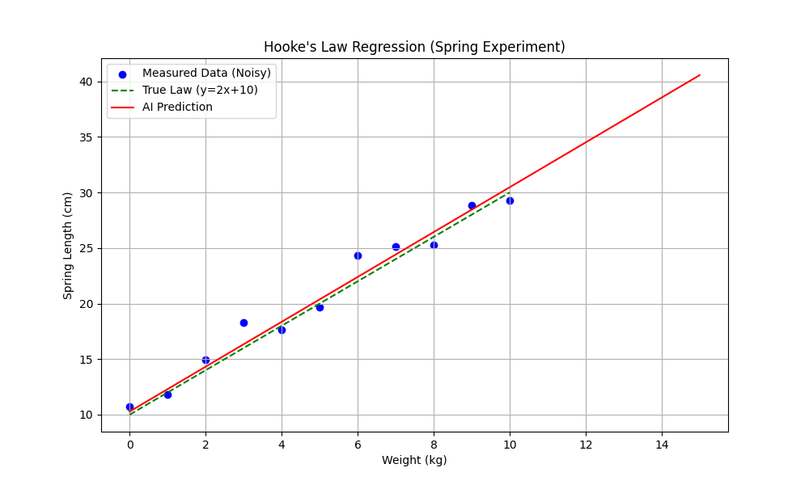
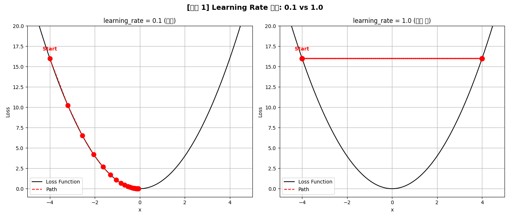
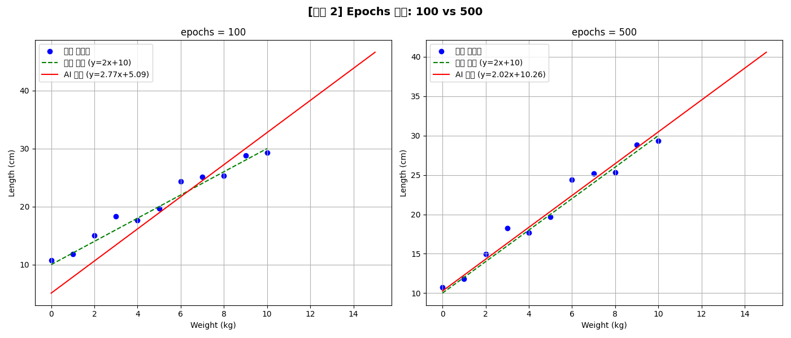
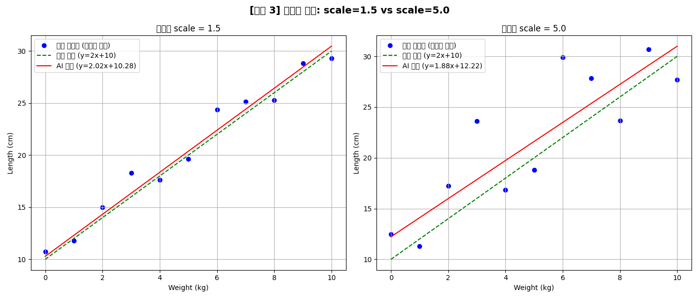
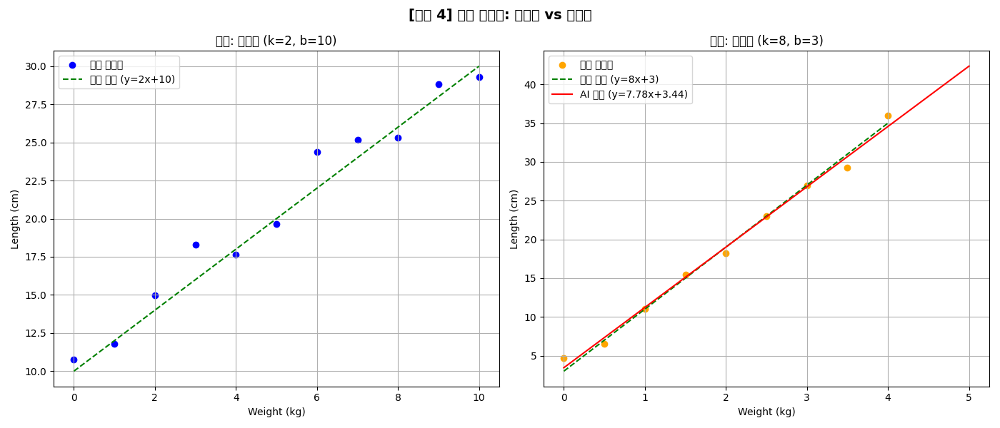

# Week 2 학습 정리: 머신러닝 기초

## 학습 체크리스트

### 개념 이해
- [x] 지도/비지도/강화 학습의 차이를 설명할 수 있다
- [x] 정규화가 왜 필요한지 이해했다
- [x] 손실 함수와 최적화의 관계를 안다
- [x] Gradient Descent의 원리를 이해한다
- [x] Epoch의 의미를 안다

### 실습 완료
- [x] K-Means 군집화를 실행하고 결과를 해석했다
- [x] 데이터 정규화 전후를 비교했다
- [x] Gradient Descent 시각화를 관찰했다
- [x] TensorFlow로 선형 회귀를 구현했다
- [x] SciPy 방법과 TensorFlow를 비교했다

### 스스로 해보기
- [o] learning_rate를 바꿔보기 → `exp_01_learning_rate.py`
- [o] epochs를 바꿔보기 → `exp_02_epochs.py`
- [o] 노이즈 크기를 바꿔보기 → `exp_03_noise.py`
- [o] 다른 데이터로 실험하기 → `exp_04_different_data.py`

---

## 1. 머신러닝의 세 가지 유형

| 유형 | 특징 | 비유 | 예시 |
|------|------|------|------|
| 지도 학습 | 입력(X)과 정답(Y)을 함께 제공 | 해설지 보며 공부 | 스팸 분류, 집값 예측 |
| 비지도 학습 | 정답 없이 데이터만 제공, AI가 패턴 발견 | 혼자 그룹 짓기 | 고객 세분화, 뉴스 분류 |
| 강화 학습 | 보상/처벌로 최적 전략 학습 | 강아지 훈련 | 알파고, 자율주행 |

---

## 2. Lab 1: K-Means 군집화 (`02_unsupervised_clustering.py`)

**알고리즘 동작 순서:**
1. 랜덤하게 K개의 중심점(centroid) 배치
2. 각 데이터를 가장 가까운 중심점에 할당
3. 각 그룹의 평균 위치로 중심점 이동
4. 중심점이 수렴할 때까지 2~3 반복

**핵심 수식 (유클리드 거리):**
```
d = sqrt( (x1-x2)^2 + (y1-y2)^2 )
```

**관찰 결과:** AI에게 정답을 알려주지 않았지만, 실제로 만든 3개 그룹을 거의 완벽하게 구분해냄.


---

## 3. Lab 2: 데이터 전처리 (`03_data_preprocessing.py`)

**문제:** 연봉(수천만 원)과 나이(20~60)의 스케일 차이 → AI가 연봉을 더 중요하다고 착각

**해결: Min-Max Normalization**
```
x_normalized = (x - x_min) / (x_max - x_min)
```
→ 모든 값을 0~1 범위로 통일

**관찰 결과:** 정규화 후 모든 특성이 동등하게 처리되어 학습이 안정적으로 진행됨.


---

## 4. Lab 3: 경사 하강법 (`04_gradient_descent_vis.py`)

**핵심 수식:**
```
x_new = x_old - learning_rate × gradient
```

**핵심 용어:**
- **Gradient (기울기):** 현재 위치에서 함수가 얼마나 가파른지
- **Learning Rate (학습률):** 한 번에 이동하는 거리

**관찰 결과:** 시작점 x=-4에서 20번 이동 후 x≈0(최소값)에 도달.


---

## 5. Lab 4: TensorFlow 선형 회귀 (`01_linear_regression_spring.py`)

**문제 설정:** 훅의 법칙 `Length = 2 × Weight + 10` 을 노이즈 있는 데이터로부터 학습

**TensorFlow 학습 과정 (1 Epoch):**
```
1. Forward Pass  → 현재 파라미터로 예측
2. Loss 계산     → MSE = Σ(예측 - 실제)² / n
3. Backward Pass → 기울기 계산 (자동 미분)
4. Update        → SGD로 파라미터 조정
```

**학습 결과:**
```
예측된 식: 길이 = 2.02 * 무게 + 10.28
실제 식  : 길이 = 2.00 * 무게 + 10.00
```
→ 500번 반복 학습 후 거의 완벽한 결과.



---

## 6. Lab 5: SciPy 비교 (`ex/`)

### TensorFlow vs SciPy 비교

| 항목 | TensorFlow | SciPy |
|------|-----------|-------|
| 접근 방식 | 반복 최적화 (500 epochs) | 수학적 최소자승법 |
| 속도 | 느림 | 빠름 (즉시) |
| 확장성 | 신경망으로 확장 가능 | 단순 모델만 |

**SciPy `curve_fit` 결과:**
```
예측된 식: 길이 = 1.93 * 무게 + 10.90
```

**SciPy `minimize` (BFGS):** 단 3번 만에 최소값 찾음 (Gradient Descent는 20번)

---

## 7. 스스로 해보기 실험 결과

### 실험 1: Learning Rate 변경 (`exp_01_learning_rate.py`)

| learning_rate | 최종 x | 결과 |
|--------------|--------|------|
| 0.1 (원본) | ≈ 0.00 | 정상 수렴 |
| 1.0 (실험) | 4.0 (진동) | 수렴 실패! |

**원인:** lr=1.0이면 `x_new = x - 1.0 × 2x = -x` → x=-4 → +4 → -4 → ... 무한 진동



### 실험 2: Epochs 변경 (`exp_02_epochs.py`)

| epochs | 학습 결과 식 | 실제 식 |
|--------|------------|---------|
| 100 | 2.77x + 5.09 | 2x + 10 |
| 500 | 2.02x + 10.26 | 2x + 10 |

**관찰:** epochs=100은 기울기(2.77)는 비슷하지만 절편(5.09)이 크게 벗어남 → 학습 부족(underfitting)



### 실험 3: 노이즈 크기 변경 (`exp_03_noise.py`)

| noise scale | 학습 결과 식 | 실제 식 |
|------------|------------|---------|
| 1.5 (원본) | 2.02x + 10.28 | 2x + 10 |
| 5.0 (실험) | 1.88x + 12.22 | 2x + 10 |

**관찰:** 노이즈가 커지면 데이터가 넓게 퍼지고, AI 예측의 오차도 커짐. 하지만 전체적인 추세는 잡아냄.



### 실험 4: 다른 데이터 (`exp_04_different_data.py`)

**설정:** 용수철 대신 고무줄 (k=8, b=3) — 훨씬 잘 늘어나는 재료

```
진짜 식: 길이 = 8.00 * 무게 + 3.00
AI 예측: 길이 = 7.78 * 무게 + 3.44
```
**관찰:** 완전히 다른 k, b 값을 가진 물리계도 동일한 방법으로 정확하게 학습함 → 선형 회귀의 범용성 확인.



---

## 핵심 공식 요약

```
Gradient Descent:      x_new = x_old - α × ∂L/∂x
Min-Max Normalization: x_norm = (x - min) / (max - min)
MSE Loss:              L = Σ(y_pred - y_true)² / n
선형 회귀 모델:         y = w × x + b
```

---

## 느낀 점 / 인사이트

1. **Learning Rate가 핵심 하이퍼파라미터다:** 너무 크면(1.0) 수렴 자체가 안 되고, 너무 작으면(0.001) 수렴이 느려진다. 0.01~0.1이 일반적으로 안전한 범위.

2. **Epochs는 수렴 여부로 결정한다:** 무조건 많다고 좋지 않다. Loss 그래프가 평탄해지면 더 반복해도 의미 없음.

3. **노이즈는 불가피하지만 머신러닝이 처리한다:** 실제 측정 데이터에는 항상 오차가 있는데, 충분한 데이터가 있으면 AI가 노이즈를 평균화하여 본질적 패턴을 찾아낸다.

4. **같은 알고리즘이 다른 물리계에도 통한다:** 용수철이든 고무줄이든 선형 관계가 있으면 동일한 선형 회귀 모델로 학습 가능. 물리 법칙을 몰라도 데이터만 있으면 관계를 찾아낼 수 있다.
